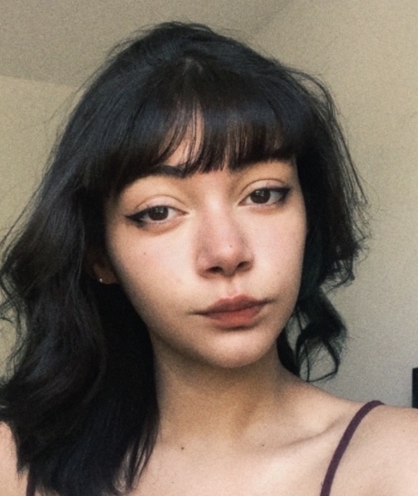

# Alura Plus

## Landing page inspirada na Alura Plus  

---

### Descrição

Este projeto é uma landing page desenvolvida como parte dos meus estudos em HTML e CSS. A proposta foi recriar a página inicial do **Alura Plus**, utilizando somente código estático (sem frameworks ou JavaScript).  
O objetivo principal foi praticar posicionamento com Flexbox, responsividade e organização de conteúdo visualmente atrativo.

---

### Dev

**Ana Clara F. D.**  
Desenvolvedora em formação, apaixonada por tecnologia e criação de interfaces web.
